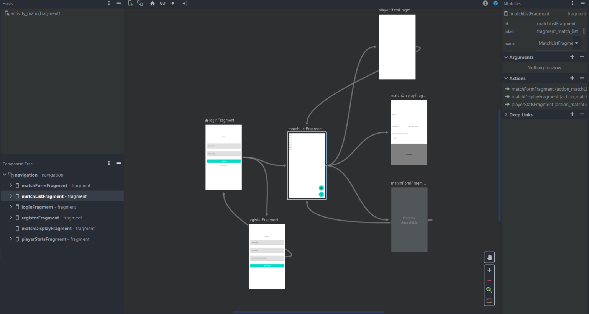

# Laser Tag Tracker

Maud Gellée & Arsène Lapostolet // EFREI M1 APP LSI

Android app to track Laser Tag games and player statistics. 

## Libraries used

### MVVM, LiveDatas and DataBinding

The Model-View-ViewModel pattern is used to have a clear separation of concerns when developping applications with a graphical user interface.

**Model** : contains Model classes, which are non-visual classes that encapsulate the app's data. It usually includes tha data model, with business, validation logic and services.

**View** : contains elements of the graphic interface ; layouts and code- behind java classes for the fragments.

**ViewModel** : Used as link between View and Model, it exposes methods to handle user actions as well as dynamic data to which the view can bind.


In conclusion, MVVM pattern helps us to enforce the single responsability principle of SOLID principles.

The Android Framework provide tools that help us implent easily the MVVM pattern. There is an abstract class named "AndroidViewModel" that our viewModels will extends in order to benefit from various fonctionnalities For instance, our viewModel will become aware of the fragment's lifecycle, which means that if the fragment is destroyed on a configuration change (like a rotation), the new instance of the owner will just re-connect to the existing viewModel.
Since we are using AndroidViewModel, we decided to use LiveData. They are observable values, which mean that we can subscribe to their changes. Thus, we will have reactive databinding and will be able to create MediatorLiveData for reactive validation.

Databinging allows us to delegate to the framework the task of filling the datas contained in the view by using source generation mechanisms in order to avoid boilerplate code. Usually we will declare a variable in the markup that will represent the viewModel class which contains every data needed in the view.
Now we will be able to bind easily our data an delete many `BindView` by adding some lines to the `onCreateView` method in order to inflate the layout into the binding, set the view (`getRoot()`) and the viewModel (`setViewModel()`). We alseo have to signal to the viewModel to which fragment's lifecycle it must connect (`setLifeCycleOwner()`) : 

```java
public View onCreateView(LayoutInflater inflater, ViewGroup container,
                             Bundle savedInstanceState) {
        // factory from the framework
        this.viewModel = ViewModelProviders.of(this).get(MatchFormViewModel.class);

        FragmentMatchFormBinding binding = DataBindingUtil.inflate(inflater,R.layout.fragment_match_form,container, false );
        binding.setViewModel(this.viewModel);
        binding.setLifecycleOwner(this);

        View view = binding.getRoot();

        return view;
    }
```

However, some particular UI element (like graphs) do not support databinding, and for those elements we decided to use Butterknife.

### Retrofit ReST Client

Retrofit is a type-safe ReST Client library for Java platforms. It allows to describe the consumed backend API as a Java interface with annotated methods. 

Exemple : 

```java
public interface LaserTagTrackerApi {

    @POST("api/auth/register")
    Call<RegisteredUserDto> register(@Body CredentialsDto dto);

    @POST("api/auth/login")
    Call<AuthSuccessDto> login(@Body CredentialsDto dto);

    ...
}
```

The implementation for the interface is generated at runtime by the library.

Retrofits is very open and configurable ; it supports both sync and async calls. We used synchronous calls to leverage the `AsyncTask` class.

### Butterknife

Butterknife is a very simple utility library that performs annotation-based views injection in code behind classes.

```java
@BindView(R.id.myButton)
public Button myButton;
```

It remove from the code the boilerplate `findViewById` calls.

### JetPack Navigation

The Jetpack Navigation library is part of Google's Jetpack framework that aims to provide more modern API to streamlined native android developement.

Navigation uses a view host (an activity) and a navigation graph to represent navigation between screens implemented by static fragments. This is the reason why we used only one activity and created only fragments afterwards instead of other activities. The navigation library leverages source generation and offers several features like : 

- Pass argument between screens
- Deep linking
- Backstack navigation
- Easy transition animations



### MP Charts

MP Charts is a plotting library for android that allows to draw all sorts of plots. Sadly, it does not support databinding, but the rendered graph are nice looking.

## Implemented Features

### Adaptable User interface

- Demonstration of dynamic fragments : in the player stats view, rotation of the screen swaps the two graphs
- Internationalization (i18n) : the app is completly translated in French and English, using the translation workbench of the android framework : changing the phone's language will dynamically change the app's language
- All screens are fully usable in both portrait and landscape orientation using the `ConstraintLayout`'s capabilities

### Geo-location

- Realtime match geo-location using the Fused API
- Address Geocoding using Android's Geocoder
- Match location are displayed on a google map

### Internal Storage

- The five last matches are stored in the embedded SQLite Database
- Photos are stored locally using local private file storage
- User's credentials and API token are stored in private Shared Preferences to provide auto-login

### External Storage

All the match data are stored in an external ReSTFull API using the following technologies : 

- Language : C# 9
- Runtime : .NET 5
- Web Framework : ASP .NET Core
- ORM : Entity Framework Core 
- RDBMS : PostgreSQL 
- Security : JWT Bearer Authentication

The API and database are both hosted using Docker containers and secured with HTTPS traffic encryption behind a reverse proxy. The API interactive docs are availaible at : https://lasertagtracker.arsenelapostolet.fr/swagger/index.html.

### Photo

The user is able to take a photo for a match with the phones camera. The photos are stored locally.

### Forms validation

The forms (login, register, match creation) are empowered with validation feature that interactivly informs the user when values are invalid using `MediatorLiveData` to reactivly compute validity and `TextInputLayout` validation API to show the error messages.

## Not Implemented Features

None

## Possible Improvements  

The one major improvement that we could underline is the image handling. Currently, they are only stored locally on the app's private file storage. Which mean that if a match is created on a phone and then retrieve on another one, the image will not appear since it does not exists on this phone. However, if a match is deleted from the local storage (when you add more than 5 matches) the image will not be deleted, so if you retreive afterward the match from the distant database, the image will still be in the phone and will appear. It would be nice to be able to upload them in the API as multipart form data and have it saved in the database as Blob Data. 

Also the list of match only gives you the last 5 matches you created on this particular phone : when a match is created on an user phone, you cannot decide to store locally this match on another phone. You'll have to retreive them from the distant Database each time you want them to be displayed, event if it is the most recent match you created. It would be interesting to add a feature that, when you retreive all distant match, you also update your local database in order to have the five most recent, whatever the phone on which they were created.

## Difficulties encountered

Our biggest difficulty was with the Databinding. When we wanted to display a number in a TextView, or create an TextInputEditText that will take a number (on the create match screen or the match detail screen) we thought at first that the databinding would convert automatically numbers to string and vice versa. However thai feature was not implemented, and we had to create or own dataBindingAdapter to achieve the conversion. The code of the bindings is in the BindingAdapters file, but we also had to declare the bindings in each fragment that would use them, since we did not find how to call custom binding adapters that were not directly in the fragment.

We also had some issue with the MP charts library, because we found the documentation quite unclear. We easily succeeded in creating simple barcharts, but it became more difficult when we decided to create bar charts with grouped bar. Hopefully, after many trials, we managed to create simple groupes bar charts.

## Architecture Diagram


## Screens

### Login Screen

### Register Screen

### Match List Screen

### Create Match Screen

### Match Detail Screen

### Player Stats Screen
